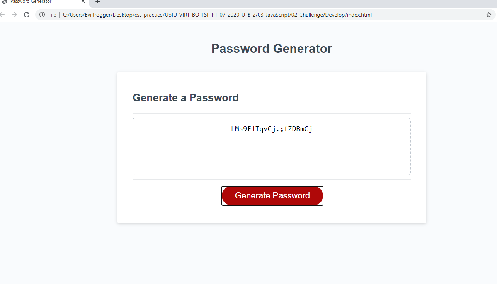

In this project we where asked to make a code generator. It will generate a random code based on the opitions the user selected.

When you click generate password a window will ask you about how long you would like your password to be. The shortest length is 8 and longest is 128. Then it will ask you what kind of character types you would like upper, lower, number and special. *NOTE you must pick aleast one. After you pick your characters a code will pop up in the middle of the screen all you have to do is copy it.

